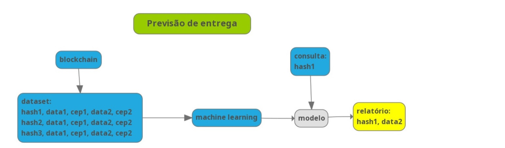

# Alysida - Previsão de entrega da cadeia de suprimentos

O site de Alysida está em http://alysida.com.br/?p=6

Inicialmente, os dados de localização e saída, e localização e chegada, vindos da Blockchain, são registados num dataset. 
A partir de um determinado número de registro, esse dataset é submido a um algoritmo de machine learning para que aprenda a prever a data de chegada das próximas remessas. 

